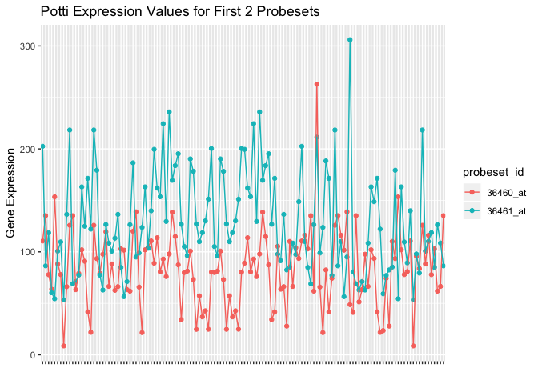
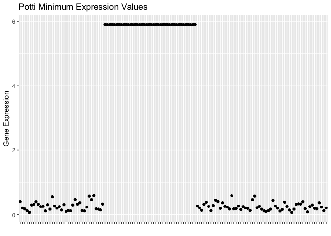
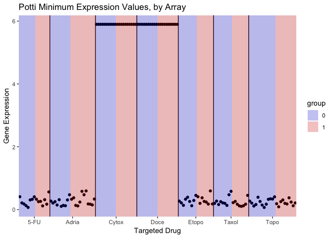
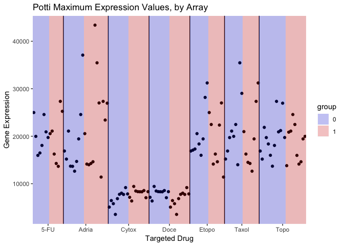
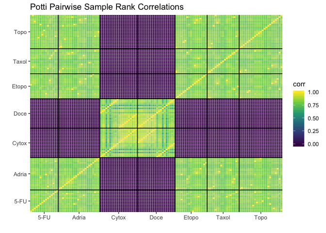

Parsing the Potti Data
================
Keith Baggerly
2018-11-12

  - [Overview](#overview)
      - [Introduction](#introduction)
      - [Data and Methods](#data-and-methods)
      - [Results](#results)
      - [Conclusions](#conclusions)
  - [Libraries](#libraries)
  - [Background on the Potti Data](#background-on-the-potti-data)
  - [Parsing the Potti Array Data](#parsing-the-potti-array-data)
      - [Loading the Data](#loading-the-data)
      - [Examining Dimensions and Column
        Names](#examining-dimensions-and-column-names)
      - [Checking for Duplicate
        Columns](#checking-for-duplicate-columns)
      - [Extracting Sample Information from Column
        Names](#extracting-sample-information-from-column-names)
      - [Creating a Tibble of Sample
        Info](#creating-a-tibble-of-sample-info)
      - [Creating a Tibble of Data
        Values](#creating-a-tibble-of-data-values)
      - [Saving the Tibbles](#saving-the-tibbles)
  - [Initial Exploratory Data
    Analysis](#initial-exploratory-data-analysis)
      - [Examining the First Few
        Values](#examining-the-first-few-values)
      - [Checking Sample Summary
        Values](#checking-sample-summary-values)
          - [Plotting Sample Minima](#plotting-sample-minima)
          - [Plotting Sample Maxima](#plotting-sample-maxima)
      - [Sample Pairwise Correlation
        Matrix](#sample-pairwise-correlation-matrix)

# Overview

## Introduction

In November 2006, [Potti et al](https://www.nature.com/articles/nm1491)
claimed to have found a way to use microarray profiles of a specific
panel of cell lines (the NCI60) to predict patient response to
chemotherapy. In order to test this ourselves, we asked them for more
detail about precisely which cell lines had been used to develop
predictors for which drugs. In response, they sent us a zip file
(“chemo.zip”) containing a tab-delimited text file (“Chemo predictors
(U-95) All - FINAL.txt”). The names of the cell lines used were not
stated in the table, so we explored whether we could use the numbers
supplied to identify the sources in other ways.

Here, we

  - document our understanding of the data more fully,
  - parse the data supplied into summary tibbles to make later analyses
    easier, and
  - perform some basic exploratory data analyses

## Data and Methods

We use the data pulled from the web with `01_gather_raw_data.R`.

We drew documentation from the figshare site where the zip file is now
posted.

We parsed the column names to infer sample information such as drug
target and contrast group (0 or 1) for each column, and assigned unique
names to each sample. We arranged this information in a tibble
(“potti\_sample\_info”).

We rearranged the data values into a tibble (“potti\_data\_values”) with
columns for sample id, probeset id, value, and initial row index of each
probeset.

We visually examined the values reported for the first few probesets. We
examined and plotted basic summary statistics (e.g., sample quantiles).
We plotted pairwise sample correlations in a heatmap.

## Results

We saved the tibbles produced in “results/potti\_data.RData”.

The sample quantiles show two clear batches: the samples for Cytoxan and
Docetaxel, and all the rest. The Cytoxan and Docetaxel columns all have
minimum values of 5.89822, suggesting some common thresholding was
applied; the other sample minima are all distinct.

The correlation heatmap shows positive correlations within each batch,
but essentially zero correlations between batches.

## Conclusions

Since most biological samples we’ve run across are at least somewhat
correlated due to basic cell maintenance, correlations of zero suggest
some type of artifact, possibly involving a scrambling of the data
across batches.

# Libraries

Here we load the libraries we’ll need for this analysis.

``` r
library(tidyverse)
library(here)
```

# Background on the Potti Data

The figshare page,

<https://figshare.com/s/66603862d770b4c73146>

has some description of the dataset which isn’t included in the
downloaded version. Some relevant excerpts:

> In late 2006, [Potti et al](https://www.nature.com/articles/nm1491)
> published an article in Nature Medicine in which they claimed to have
> found a way to use drug sensitivity information and genomic profiles
> of cell lines to infer likely patient response to treatment from a
> patient’s genomic profile.

> The cell lines in question were those from the NCI60 panel, which has
> been maintained by the National Cancer Institute (NCI) for many
> decades.

> Since investigators at MD Anderson wanted to use the approach to
> improve care, they asked us for help evaluating the approach. We asked
> the authors if they could be more specific about precisely which
> genomic profiles were being used, and which cell lines were being
> treated as sensitive and resistant for each of the 7 drugs they
> examined.

> The first file we got back in response was the “chemo.zip” file
> included here.

# Parsing the Potti Array Data

## Loading the Data

Here we load the array data into a tibble.

``` r
potti_tibble <- 
  read_delim(here::here("data", "chemo.zip"), delim = "\t")
```

    ## Parsed with column specification:
    ## cols(
    ##   .default = col_double(),
    ##   probe_set = col_character()
    ## )

    ## See spec(...) for full column specifications.

``` r
dim(potti_tibble)
```

    ## [1] 12558   135

``` r
print(potti_tibble, n_extra = 20)
```

    ## # A tibble: 12,558 x 135
    ##    probe_set Adria0   `0`  `0_1`  `0_2`  `0_3` `0_4`  `0_5` `0_6` `0_7`
    ##    <chr>      <dbl> <dbl>  <dbl>  <dbl>  <dbl> <dbl>  <dbl> <dbl> <dbl>
    ##  1 36460_at   41.7   21.8 126.    93.5   79.1   97.7 119.    66.4  88.2
    ##  2 36461_at  171.   122.  218.   179.    77.5   62.9 127.   108.  101. 
    ##  3 36462_at  147.   204.  211.   209.   217.   262.  204.   232.  334. 
    ##  4 36463_at  152.   122.  128.   186.   112.   154.  232.   165.   92.4
    ##  5 36464_at   21.0   35.4  12.2   19.5    8.65  23.5   5.47  30.4  41.9
    ##  6 36465_at  144.    95.2  12.8   83.6   30.1  246.   67.5   91.4 151. 
    ##  7 36466_at   21.8   26.4  29.4    5.86  18.5   28.6  34.3   12.7  34.2
    ##  8 36467_g_…   4.94  10.0   7.36   2.62   7.87  14.2   4.42  13.0  15.0
    ##  9 36468_at   59.6   51.7  29.8   26.1   10.9   43.9  14.3   56.5  16.0
    ## 10 36469_at   51.6   80.4  19.6   41.1   41.6   73.2  96.3   94.7  86.8
    ## # ... with 12,548 more rows, and 125 more variables: `0_8` <dbl>,
    ## #   `1` <dbl>, `1_1` <dbl>, `1_2` <dbl>, `1_3` <dbl>, `1_4` <dbl>,
    ## #   `1_5` <dbl>, `1_6` <dbl>, `1_7` <dbl>, `1_8` <dbl>, `1_9` <dbl>,
    ## #   `1_10` <dbl>, Adria1 <dbl>, Doce0 <dbl>, `0_9` <dbl>, `0_10` <dbl>,
    ## #   `0_11` <dbl>, `0_12` <dbl>, `0_13` <dbl>, `0_14` <dbl>, …

The uncompressed data file, “Chemo predictors (U-95) All - FINAL.txt”,
is a tab-delimited file with a 12559 rows: 1 header row and 12558 data
rows, where each row corresponds to a probeset id from the Affymetrix
U-95A gene chip (sequences used to query the transcriptome were built
using the 95th assembly of the Unigene consensus definitions). There are
actually 12625 probesets on the U-95A, but 67 of these are “control
probes” used to assess general functioning of the assay. The control
probe names begin with “AFFX”, and the row count suggests these are
missing here. Let’s check this.

``` r
grep("^AFFX", potti_tibble$probe_set)
```

    ## integer(0)

Yep, it looks like the control probesets have been removed.

## Examining Dimensions and Column Names

There are 135 columns in the dataset. The first column lists the
probeset ids (rownames), and the rest give (we presume) expression
measurements from one of the cell lines in the NCI-60 panel. The column
names suggest the columns are grouped by drug, as there are 7 “name
blocks” which start with

“(drug name)0 0 0…” and end with “…1 1 1 (drug name)1”

For a given drug, we suspect 0/1 labels indicate sensitive/resistant
status, with 0 indicating one group and 1 indicating the other. We do
not see anything in the dataset itself specifying which group is which.

Total numbers of cell lines vary by drug, as do relative numbers of 0’s
and 1’s. It’s not immediately clear what rule was used to select these
just these lines.

## Checking for Duplicate Columns

Since the total number of data columns (134) exceeds the number of cell
lines in the NCI60 panel (59), we suspect some columns should be
repeated, indicating some cell lines supplied information about more
than one drug.

Looking at the data matrix with View, we see the expression values are
recorded to 6 decimal places, so matching just one probeset may serve to
match the entire column. Looking at the first row (probeset 36460\_at)
and first column (Adria0), we see a value of 41.671947. Let’s check for
ties.

``` r
which(potti_tibble[1, ] == potti_tibble[[2]][1])
```

    ## [1]   2  44  96 120

There are 4 data columns with the same first value. We can check the
first few values from each of these columns to see if equality persists.

``` r
potti_tibble[1:10, c(1, which(potti_tibble[1, ] == 
                           potti_tibble[[2]][1]))]
```

    ## # A tibble: 10 x 5
    ##    probe_set  Adria0 Etopo0  Topo0 `0_54`
    ##    <chr>       <dbl>  <dbl>  <dbl>  <dbl>
    ##  1 36460_at    41.7   41.7   41.7   41.7 
    ##  2 36461_at   171.   171.   171.   171.  
    ##  3 36462_at   147.   147.   147.   147.  
    ##  4 36463_at   152.   152.   152.   152.  
    ##  5 36464_at    21.0   21.0   21.0   21.0 
    ##  6 36465_at   144.   144.   144.   144.  
    ##  7 36466_at    21.8   21.8   21.8   21.8 
    ##  8 36467_g_at   4.94   4.94   4.94   4.94
    ##  9 36468_at    59.6   59.6   59.6   59.6 
    ## 10 36469_at    51.6   51.6   51.6   51.6

Yep, we’re dealing with duplicated columns.

## Extracting Sample Information from Column Names

Let’s parse the sample names to extract the pieces of information our
interpretations suggest.

``` r
## Grab the names we have now

potti_names <- names(potti_tibble)[-1]
n_samples <- length(potti_names)

## strip the suffixes added to avoid duplication

potti_names_raw <- 
  gsub("_[[:digit:]]+$", "", potti_names)

## use the trailing 0/1 to define a "contrast group"

contrast_group <- 
  substr(potti_names_raw, 
         nchar(potti_names_raw), nchar(potti_names_raw))

## extract the flanking drug names

drug_name <- rep(NA, n_samples)
drug_name[nchar(potti_names_raw) > 1] <- 
  substr(potti_names_raw[nchar(potti_names_raw) > 1],
         1, nchar(potti_names_raw)[nchar(potti_names_raw) > 1] - 1)  

## keep track of the initial column index from the data table
## using a 0-padded string of length 3

column_index <- sprintf("%03d", c(1:n_samples))
```

## Creating a Tibble of Sample Info

Now let’s bundle all of this info in a tibble for later use.

``` r
potti_sample_info <- 
  tibble(drug_name = drug_name,
         contrast_group = contrast_group,
         column_index = column_index)
potti_sample_info <- 
  tidyr::fill(potti_sample_info, drug_name)

potti_sample_info <-
  potti_sample_info %>% 
  mutate(sample_id = 
           paste(drug_name, contrast_group, 
                 column_index, sep = "_")) %>% 
  select(sample_id, drug_name, contrast_group, column_index)

potti_sample_info
```

    ## # A tibble: 134 x 4
    ##    sample_id   drug_name contrast_group column_index
    ##    <chr>       <chr>     <chr>          <chr>       
    ##  1 Adria_0_001 Adria     0              001         
    ##  2 Adria_0_002 Adria     0              002         
    ##  3 Adria_0_003 Adria     0              003         
    ##  4 Adria_0_004 Adria     0              004         
    ##  5 Adria_0_005 Adria     0              005         
    ##  6 Adria_0_006 Adria     0              006         
    ##  7 Adria_0_007 Adria     0              007         
    ##  8 Adria_0_008 Adria     0              008         
    ##  9 Adria_0_009 Adria     0              009         
    ## 10 Adria_0_010 Adria     0              010         
    ## # ... with 124 more rows

``` r
## clean up

rm(column_index, contrast_group, drug_name, 
   potti_names, potti_names_raw)
```

## Creating a Tibble of Data Values

Now that we have more useable sample names, let’s rename the initial
data tibble and parse it.

``` r
names(potti_tibble)[2:(n_samples + 1)] <- 
  potti_sample_info$sample_id

potti_data_values <- 
  potti_tibble %>% 
  gather(-1, key = "sample_id", value = "value")
potti_data_values$row_index <- 
  rep(1:nrow(potti_tibble), n_samples)

potti_data_values <-
  potti_data_values %>% 
  rename(probeset_id = probe_set) %>% 
  select(sample_id, probeset_id, value, row_index)

potti_data_values
```

    ## # A tibble: 1,682,772 x 4
    ##    sample_id   probeset_id  value row_index
    ##    <chr>       <chr>        <dbl>     <int>
    ##  1 Adria_0_001 36460_at     41.7          1
    ##  2 Adria_0_001 36461_at    171.           2
    ##  3 Adria_0_001 36462_at    147.           3
    ##  4 Adria_0_001 36463_at    152.           4
    ##  5 Adria_0_001 36464_at     21.0          5
    ##  6 Adria_0_001 36465_at    144.           6
    ##  7 Adria_0_001 36466_at     21.8          7
    ##  8 Adria_0_001 36467_g_at    4.94         8
    ##  9 Adria_0_001 36468_at     59.6          9
    ## 10 Adria_0_001 36469_at     51.6         10
    ## # ... with 1,682,762 more rows

## Saving the Tibbles

Now we save the component tibbles for later analysis.

``` r
save(potti_sample_info,
     potti_data_values,
     file = here::here("results", "potti_data.RData"))
```

# Initial Exploratory Data Analysis

As a sanity check, we do some quick skims of the data.

## Examining the First Few Values

We eyeball the values of the first few probesets across samples to see
if the samples look comparable.

``` r
potti_first_data <-
  potti_data_values %>% 
  filter(row_index < 3)

potti_first_probeset_plots <- 
  ggplot(potti_first_data, 
         aes(sample_id, value, group = probeset_id,
             colour = probeset_id)) +
  geom_point() + 
  geom_line() +
  ylab("Gene Expression") + 
  xlab("") +
  ggtitle("Potti Expression Values for First 2 Probesets") +
  theme(axis.text.x = element_blank())

potti_first_probeset_plots
```

<!-- -->

These look roughly fine to me - no clear evidence of something like one
probeset having high values for one subset of samples and low values for
the others.

## Checking Sample Summary Values

We also check some standard summary values (min, med, max) in case
something odd shows up.

``` r
potti_sample_ranges <- 
  potti_data_values %>% 
  group_by(sample_id) %>% 
  summarise(q000_min = min(value),
            q050_med = median(value),
            q100_max = max(value))
potti_sample_ranges$sample_index <- c(1:n_samples)

potti_sample_ranges
```

    ## # A tibble: 134 x 5
    ##    sample_id  q000_min q050_med q100_max sample_index
    ##    <chr>         <dbl>    <dbl>    <dbl>        <int>
    ##  1 5-FU_0_060   0.409      53.0   24989             1
    ##  2 5-FU_0_061   0.211      45.8   19971.            2
    ##  3 5-FU_0_062   0.178      41.3   15964.            3
    ##  4 5-FU_0_063   0.125      48.4   16478.            4
    ##  5 5-FU_0_064   0.0677     49.5   18064.            5
    ##  6 5-FU_0_065   0.306      51.6   24571.            6
    ##  7 5-FU_0_066   0.327      45.0   20920.            7
    ##  8 5-FU_0_067   0.406      54.7   19732.            8
    ##  9 5-FU_1_068   0.330      47.7   20549.            9
    ## 10 5-FU_1_069   0.252      47.9   21087.           10
    ## # ... with 124 more rows

Nothing jumps out from the first few values. Let’s plot the minima to be
more comprehensive.

``` r
ggplot(potti_sample_ranges, aes(sample_id, q000_min)) + 
  geom_point() + 
  ylab("Gene Expression") + 
  xlab("") +
  ggtitle("Potti Minimum Expression Values") +
  theme(axis.text.x = element_blank())
```

<!-- -->

Wow. Plotting the minima shows one contiguous block of samples behaving
very differently from all the rest. Since the samples are alphabetically
ordered by sample id, and these ids begin with the name of the drug
nominally being examined, this suggests all of the samples for a few
drugs are very different.

Let’s identify the drug and contrast group boundaries so we can add
these to the plot.

``` r
temp <- 
  potti_sample_info %>% 
  arrange(sample_id)

drug_breaks <- 
  which(temp$drug_name[1:(nrow(temp) - 1)] != 
        temp$drug_name[2:nrow(temp)]) + 0.5

drug_centers <- 
  c(0.5, drug_breaks) +
  diff(c(0.5, drug_breaks, nrow(temp) + 0.5)) / 2

group_breaks <- 
  which(temp$contrast_group[1:(nrow(temp) - 1)] != 
        temp$contrast_group[2:nrow(temp)]) + 0.5

contrast_tibble <- 
  tibble(
    drug = temp$drug_name[floor(c(group_breaks, n_samples))],
    group = temp$contrast_group[floor(c(group_breaks, n_samples))],
    start = c(0.5, group_breaks),
    end = c(group_breaks, n_samples + 0.5))
```

### Plotting Sample Minima

Now let’s plot the minima with revised
labels.

<!-- -->

All of the samples for Cytoxan (Cytox) and Docetaxel (Doce) are
different than those for the other drugs. Their minima have been
thresholded to the same value. Let’s check what that value is.

``` r
potti_sample_ranges$q000_min[grep("Cytox",
                                  potti_sample_ranges$sample_id)]
```

    ##  [1] 5.89822 5.89822 5.89822 5.89822 5.89822 5.89822 5.89822 5.89822
    ##  [9] 5.89822 5.89822 5.89822 5.89822 5.89822 5.89822 5.89822 5.89822
    ## [17] 5.89822 5.89822 5.89822 5.89822

``` r
potti_sample_ranges$q000_min[grep("Doce", 
                                  potti_sample_ranges$sample_id)]
```

    ##  [1] 5.89822 5.89822 5.89822 5.89822 5.89822 5.89822 5.89822 5.89822
    ##  [9] 5.89822 5.89822 5.89822 5.89822 5.89822 5.89822 5.89822 5.89822
    ## [17] 5.89822 5.89822 5.89822 5.89822

The value 5.89822 looks special somehow.

### Plotting Sample Maxima

Let’s check the maxima
too.

<!-- -->

Again, the values for Cytoxan and Docetaxel are clearly different.

Let’s check the values of the maxima.

``` r
potti_sample_ranges$q100_max[grep("Cytox", 
                                  potti_sample_ranges$sample_id)]
```

    ##  [1] 5071.45 6450.02 5800.57 3536.18 6858.77 7768.62 8018.92 7740.35
    ##  [9] 9185.56 7849.80 7141.54 6364.11 9432.49 8467.64 8333.31 8308.82
    ## [17] 8297.27 8568.00 7058.44 8330.29

``` r
potti_sample_ranges$q100_max[grep("Doce", 
                                  potti_sample_ranges$sample_id)]
```

    ##  [1] 7141.54 6364.11 9432.49 8467.64 8333.31 8308.82 8297.27 8568.00
    ##  [9] 7058.44 8330.29 5071.45 6450.02 5800.57 3536.18 6858.77 7768.62
    ## [17] 8018.92 7740.35 9185.56 7849.80

Here we can see another pattern - values 1:10 for Cytoxan are values
11:20 for Docetaxel, and vice versa. This implies the same samples are
being used for two different drugs, but with directions reversed. This
is surprising, since these two drugs have often been used in conjunction
with each other.

## Sample Pairwise Correlation Matrix

We also examine the pairwise sample correlations.

We do this by first mapping from the full data tibble to a gene by
sample matrix of values, compute the correlation matrix using the matrix
implementation in `cor`, and then map back to a tibble for plotting
purposes.

Let’s compute the correlations.

``` r
potti_data_matrix <- 
  potti_data_values %>% 
  select(sample_id, probeset_id, value) %>% 
  spread(sample_id, value) %>% 
  select(-probeset_id) %>% 
  as.matrix()

potti_cor_matrix <- 
  cor(potti_data_matrix, potti_data_matrix, method = "spearman")

potti_cor_tibble <- 
  tibble(sample_1 = rep(colnames(potti_cor_matrix), 
                     each = nrow(potti_cor_matrix)),
         sample_2 = rep(rownames(potti_cor_matrix),
                     times = ncol(potti_cor_matrix)),
         corr = as.vector(potti_cor_matrix))

rm(potti_data_matrix, potti_cor_matrix)
```

Now we plot a correlation heatmap.

``` r
potti_cor_tibble$index_1 <- rep(c(1:n_samples), each = n_samples)
potti_cor_tibble$index_2 <- rep(c(1:n_samples), n_samples)

potti_cor_heatmap <- 
  ggplot(potti_cor_tibble, aes(index_1, index_2)) + 
  geom_tile(aes(fill = corr), color = "white") + 
  scale_fill_viridis_c() + 
  geom_vline(xintercept = drug_breaks) + 
  geom_hline(yintercept = drug_breaks) + 
  scale_x_continuous(
    breaks = drug_centers, 
    labels = temp$drug_name[floor(drug_centers)],
    limits = c(0.5, n_samples + 0.5),
    expand = c(0,0)) +
  scale_y_continuous(
    breaks = drug_centers, 
    labels = temp$drug_name[floor(drug_centers)],
    limits = c(0.5, n_samples + 0.5),
    expand = c(0,0)) +
  ylab("") + 
  xlab("") + 
  ggtitle("Potti Pairwise Sample Rank Correlations") 

potti_cor_heatmap  
```

<!-- -->

The values for Cytoxan and Docetaxel are clearly different. The
correlations between these samples and the others are clustered around
**zero**. Correlations this low between biological samples are unlikely
since quite a few genes are focused on simply keeping cells alive, which
biases correlations to be somewhat positive. Zero correlations suggest
an artifact, specifically some type of label scrambling between the two
groups.

This raises the questions of whether we can identify the source samples
and the source orderings for the two recognizable subgroups.
