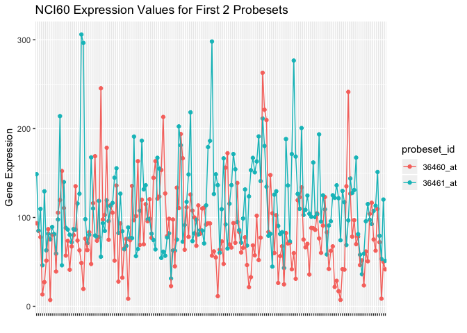
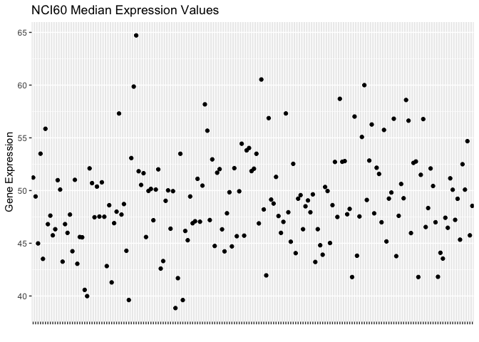
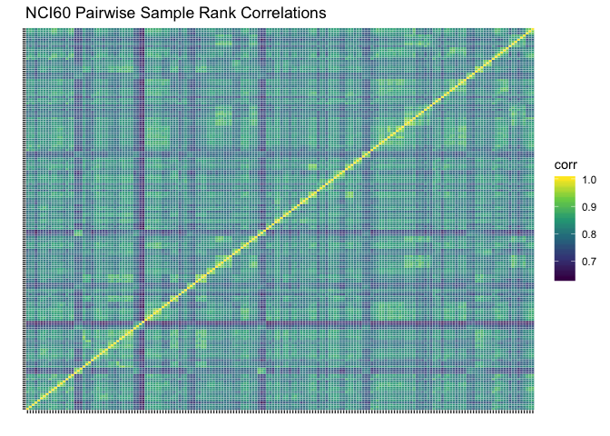

Parsing the NCI60 Data
================
Keith Baggerly
2018-11-12

  - [Overview](#overview)
      - [Introduction](#introduction)
      - [Data and Methods](#data-and-methods)
      - [Results](#results)
  - [Libraries](#libraries)
  - [Background on the NCI60](#background-on-the-nci60)
  - [Parsing the NCI60 Data](#parsing-the-nci60-data)
      - [Loading the Data](#loading-the-data)
      - [Counting Arrays and Probesets](#counting-arrays-and-probesets)
      - [Examining the First Few Data
        Rows](#examining-the-first-few-data-rows)
      - [Constructing Array
        Identifiers](#constructing-array-identifiers)
      - [Looking for Duplicate Probeset
        Values](#looking-for-duplicate-probeset-values)
      - [Checking Consistency of Export
        Order](#checking-consistency-of-export-order)
      - [Removing the Duplicate
        Probeset](#removing-the-duplicate-probeset)
      - [Creating a Tibble of Sample
        Information](#creating-a-tibble-of-sample-information)
      - [Creating a Tibble of Probeset
        Information](#creating-a-tibble-of-probeset-information)
      - [Creating a Tibble of Data
        Values](#creating-a-tibble-of-data-values)
      - [Saving the Tibbles](#saving-the-tibbles)
  - [Initial Exploratory Data
    Analysis](#initial-exploratory-data-analysis)
      - [Examining the First Few
        Values](#examining-the-first-few-values)
      - [Checking Locations of Control (AFFX)
        Probes](#checking-locations-of-control-affx-probes)
      - [Checking Sample Summary
        Values](#checking-sample-summary-values)
      - [Sample Pairwise Correlation
        Matrix](#sample-pairwise-correlation-matrix)

# Overview

## Introduction

[Potti et al](https://www.nature.com/articles/nm1491) built predictors
of drug response using microarray profiles of the NCI60 cell lines.

Here, we

  - document our understanding of the NCI60 data more fully,
  - parse the data supplied into summary tibbles to make later analyses
    easier, and
  - perform some basic exploratory data analyses

## Data and Methods

We use the data pulled from the web with `01_gather_raw_data.R`.

We drew documentation from the figshare site where the zip file with the
data from Potti et al is now posted.

We parsed the identifiers supplied for “ID” to extract array replicate
information and combined this with “cellname” to construct
array-specific identifiers. We parsed the annotation supplied to
construct tibbles of sample information (“nci60\_sample\_info”) and
probeset information (“nci60\_probeset\_info”).

We rearranged the data values into a tibble (“nci60\_data\_values”) with
columns for sample id, probeset id, value, detection (P/F, from the
Affymetrix software), p-value (for P/F detection) and initial row index
of each probeset.

We visually examined the values reported for the first few probesets. We
examined and plotted basic summary statistics (e.g., sample quantiles).
We plotted pairwise sample correlations in a heatmap.

## Results

We saved the tibbles produced in “results/nci60\_data.RData”.

Values for one probeset, `100_g_at`, were reported twice because this
probeset was mapped to two distinct gene cluster ids. We dropped one set
of values to avoid duplication.

Counting replicate suffixes (A, B, C, or D) shows most of the 59 cell
lines were run in triplicate; one was run in duplicate and four were run
in quadruplicate for a total of 180 arrays.

Nothing from the EDA plots looked particularly striking. There is some
slight “blockiness” in the sample correlation heatmap, which may be due
to replicates clumping together.

# Libraries

Here we load the libraries we’ll need for this analysis.

``` r
library(tidyverse)
library(here)
```

# Background on the NCI60

There are 59 distinct cell lines in the NCI60 panel. Both drug
sensitivity and genomic profile information for these cell lines are
publicly available from the NCI’s Developmental Therapeutics Program
(DTP). A list of the cell lines in the panel is available here

<https://dtp.cancer.gov/discovery_development/nci-60/cell_list.htm>

This list also includes links for a few of the cell lines which have
been discovered to be something other that what they were thought to be
in many earlier studies. There were 60 cell lines when the NCI60 panel
was first developed, but cell line MDA-N was soon found to have been
derived from MDA-MB-435, so MDA-N has rarely been separately profiled
since.

The raw NCI60 microarray data is available from the DTP:
<https://wiki.nci.nih.gov/display/ncidtpdata/molecular+target+data> This
page has a link to data from Affymetrix U95A arrays run on the panel in
triplicate by Novartis, “WEB\_DATA\_NOVARTIS\_ALL.ZIP”

The current data on growth inhibition is here:
<https://wiki.nci.nih.gov/display/NCIDTPdata/NCI-60+Growth+Inhibition+Data>

The molecular target data page above also contains some brief
descriptions of the types of information reported in the various table
columns

> When uncompressed the file is comma delimited in the following format:

> File Format: Probe Set Name, ID (composite of the moltid derived from
> this measurement, and a letter to distinguish individual arrays),
> GENE, cellname, pname, PANELNBR, CELLNBR, Signal, Detection, P value
> Gene assignments are based on Unigene Build \#U225 (August 2010)

# Parsing the NCI60 Data

## Loading the Data

Here we load the array data from the DTP into a tibble.

``` r
nci60_tibble <- 
  read_csv(here::here("data", "WEB_DATA_NOVARTIS_ALL.zip"))
```

    ## Parsed with column specification:
    ## cols(
    ##   `Probe Set Name` = col_character(),
    ##   ID = col_character(),
    ##   GENE = col_character(),
    ##   panelnbr = col_integer(),
    ##   cellnbr = col_integer(),
    ##   pname = col_character(),
    ##   cellname = col_character(),
    ##   Signal = col_double(),
    ##   Detection = col_character(),
    ##   `P Value` = col_double()
    ## )

``` r
nci60_tibble
```

    ## # A tibble: 2,272,680 x 10
    ##    `Probe Set Name` ID    GENE  panelnbr cellnbr pname cellname Signal
    ##    <chr>            <chr> <chr>    <int>   <int> <chr> <chr>     <dbl>
    ##  1 36460_at         GC26… POLR…        7       5 Leuk… K-562     120. 
    ##  2 36460_at         GC26… POLR…        7       6 Leuk… MOLT-4    114. 
    ##  3 36460_at         GC26… POLR…        7       3 Leuk… CCRF-CEM   67.4
    ##  4 36460_at         GC26… POLR…        7      10 Leuk… RPMI-82…  148. 
    ##  5 36460_at         GC26… POLR…        7       8 Leuk… HL-60(T…  105. 
    ##  6 36460_at         GC26… POLR…        7      19 Leuk… SR         41.8
    ##  7 36460_at         GC26… POLR…       12      14 CNS   SF-268     67.6
    ##  8 36460_at         GC26… POLR…       12      15 CNS   SF-295     70.8
    ##  9 36460_at         GC26… POLR…       12      16 CNS   SF-539     59.9
    ## 10 36460_at         GC26… POLR…       12       2 CNS   SNB-19     62.4
    ## # ... with 2,272,670 more rows, and 2 more variables: Detection <chr>, `P
    ## #   Value` <dbl>

``` r
length(unique(nci60_tibble$`Probe Set Name`))
```

    ## [1] 12625

``` r
nrow(nci60_tibble) / length(unique(nci60_tibble$`Probe Set Name`))
```

    ## [1] 180.0143

``` r
length(unique(nci60_tibble$cellname))
```

    ## [1] 59

## Counting Arrays and Probesets

We double check a few basic numbers like the numbers of arrays,
probesets, etc.

``` r
n_probesets <- length(unique(nci60_tibble$`Probe Set Name`))
n_probesets
```

    ## [1] 12625

``` r
n_cell_lines <- length(unique(nci60_tibble$cellname))
n_cell_lines
```

    ## [1] 59

``` r
nrow(nci60_tibble) / n_probesets
```

    ## [1] 180.0143

``` r
nrow(nci60_tibble) / 180
```

    ## [1] 12626

The number of distinct probesets is what we would expect for U95A
arrays, and the number of distinct cell lines matches the number we know
of in the NCI60 panel.

The number of data rows, however, isn’t what we expected going in. Each
cell line was intended to be profiled in triplicate, so we expected to
see data on 3 \* 59 = 177 arrays. We appear to have data on a *fraction*
over 180 arrays worth of data. More specifically, the number of rows
matches what we would expect from 180 arrays with 12626, not 12625,
measurements per array, which suggests (a) some cell lines were run more
than 3 times and (b) we may have duplicate entries for at least one
probeset.

## Examining the First Few Data Rows

Let’s take a closer look at the first few rows to better understand the
structure.

``` r
knitr::kable(nci60_tibble[1:13, ])
```

| Probe Set Name | ID         | GENE   | panelnbr | cellnbr | pname    | cellname  |    Signal | Detection |  P Value |
| :------------- | :--------- | :----- | -------: | ------: | :------- | :-------- | --------: | :-------- | -------: |
| 36460\_at      | GC26855\_B | POLR1C |        7 |       5 | Leukemia | K-562     | 120.47874 | P         | 0.017001 |
| 36460\_at      | GC26855\_B | POLR1C |        7 |       6 | Leukemia | MOLT-4    | 113.54223 | P         | 0.001892 |
| 36460\_at      | GC26855\_B | POLR1C |        7 |       3 | Leukemia | CCRF-CEM  |  67.42072 | P         | 0.017001 |
| 36460\_at      | GC26855\_B | POLR1C |        7 |      10 | Leukemia | RPMI-8226 | 147.79152 | P         | 0.006532 |
| 36460\_at      | GC26855\_B | POLR1C |        7 |       8 | Leukemia | HL-60(TB) | 105.39195 | P         | 0.001892 |
| 36460\_at      | GC26855\_B | POLR1C |        7 |      19 | Leukemia | SR        |  41.76432 | A         | 0.127645 |
| 36460\_at      | GC26855\_B | POLR1C |       12 |      14 | CNS      | SF-268    |  67.58099 | P         | 0.021866 |
| 36460\_at      | GC26855\_B | POLR1C |       12 |      15 | CNS      | SF-295    |  70.79137 | P         | 0.005643 |
| 36460\_at      | GC26855\_B | POLR1C |       12 |      16 | CNS      | SF-539    |  59.85019 | P         | 0.008689 |
| 36460\_at      | GC26855\_B | POLR1C |       12 |       2 | CNS      | SNB-19    |  62.42240 | P         | 0.021866 |
| 36460\_at      | GC26855\_B | POLR1C |       12 |       5 | CNS      | SNB-75    |  28.80082 | A         | 0.302547 |
| 36460\_at      | GC26855\_B | POLR1C |       12 |       9 | CNS      | U251      |  61.72136 | P         | 0.039365 |
| 36460\_at      | GC26855\_A | POLR1C |        7 |       5 | Leukemia | K-562     |  95.75866 | P         | 0.027860 |

Many different tumor types are represented in the NCI60 panel, so cell
lines of a given type are often grouped into subpanels. Looking at the
first row, we see that K-562 is a Leukemia cell line, and the Leukemia
panel is number 7. K-562 is the 5th cell line of a larger leukemia
panel; this larger panel includes some cell lines which are not included
in the NCI60.

## Constructing Array Identifiers

Interestingly, there isn’t a column indicating what array a given
measurement came from. Such a column should indicate both the cell line
profiled and the replicate number or index.

The cell line names we want are in the “cellname” column. The replicate
index for the array, however, is given by the one-letter suffix in the
“ID” column - the first 12 rows are reporting values from the “B” set
of array replicates for the cell lines named. Row 13, by contrast, is
reporting the value of probeset 36460\_at for the “A” set replicate of
cell line K-562, which is a leukemia cell line. The first part of the
ID, however, is a gene label, not an array label - e.g., “GC26855” is
the gene cluster corresponding to POL1RC. We would expect these GC ids
to map roughly one-to-one to probeset ids. Let’s check this
interpretation.

``` r
table(substr(nci60_tibble$ID, 
             nchar(nci60_tibble$ID) - 1, 
             nchar(nci60_tibble$ID)))
```

    ## 
    ##     _A     _B     _C     _D 
    ## 744934 744934 732308  50504

``` r
table(substr(nci60_tibble$ID, 
             nchar(nci60_tibble$ID), 
             nchar(nci60_tibble$ID))) / 12626
```

    ## 
    ##  A  B  C  D 
    ## 59 59 58  4

The replicate interpretation seems to hold up, and suggests 4 cell lines
were profiled 4 times (the “D” count), whereas 1 cell line was only
profiled twice (since the “C” count is 58, not 59).

Let’s add replicate id, gc id, and array id as separate columns.

``` r
nci60_tibble <-
  nci60_tibble %>% 
  mutate(rep_id = substr(ID, nchar(ID), nchar(ID)),
         gc_id = substr(ID, 1, nchar(ID) - 2),
         sample_id = paste0(cellname, "_", rep_id))
length(unique(nci60_tibble$gc_id))
```

    ## [1] 12626

## Looking for Duplicate Probeset Values

Since there are 12626 gc ids, this suggests one probeset was mapped to
two gc ids. We can check this by counting the number of times each
probeset appears.

``` r
probeset_counts <- 
  nci60_tibble %>%
  group_by(`Probe Set Name`) %>% 
  summarise(n = n())

table(probeset_counts$n)
```

    ## 
    ##   180   360 
    ## 12624     1

``` r
probeset_counts[probeset_counts$n == 360, ]
```

    ## # A tibble: 1 x 2
    ##   `Probe Set Name`     n
    ##   <chr>            <int>
    ## 1 100_g_at           360

``` r
table(nci60_tibble$gc_id[nci60_tibble$`Probe Set Name` == 
  "100_g_at"])
```

    ## 
    ## GC32976 GC32977 
    ##     180     180

Yep, as it happens, there’s just one probeset present twice as often as
it needs to be, and it maps to two distinct gc ids. Since gc id isn’t of
great importance to us, we can simply drop the entries for one of them
as long as the values are the same. Let’s check this equivalence.

``` r
small_table <-
  nci60_tibble %>% 
  filter(`Probe Set Name` == "100_g_at") %>% 
  select(Signal, gc_id, sample_id) %>% 
  spread(key = gc_id, value = Signal)

small_table
```

    ## # A tibble: 180 x 3
    ##    sample_id   GC32976 GC32977
    ##    <chr>         <dbl>   <dbl>
    ##  1 786-0_A        216.    216.
    ##  2 786-0_B        215.    215.
    ##  3 A498_A         214.    214.
    ##  4 A498_B         198.    198.
    ##  5 A498_C         170.    170.
    ##  6 A549/ATCC_A    157.    157.
    ##  7 A549/ATCC_B    171.    171.
    ##  8 A549/ATCC_C    255.    255.
    ##  9 ACHN_A         216.    216.
    ## 10 ACHN_B         146.    146.
    ## # ... with 170 more rows

``` r
all(small_table$GC32976 == small_table$GC32977)
```

    ## [1] TRUE

The values match, so we can drop the results for one of the two gc ids.

## Checking Consistency of Export Order

At this point, the data appears to have been exported from a database
using a consistent procedure, in which values are reported one probeset
(or gc id) at a time, with samples being exported in the same order for
each probeset. We run a few sanity checks to confirm this
interpretation.

``` r
n_samples <- 180
n_gc_ids <- 12626

## columns whose values should repeat like samples

temp <- 
  nci60_tibble %>% 
  select(panelnbr, cellnbr, pname, cellname, rep_id, sample_id)
all_equal(temp, temp[rep(c(1:n_samples), n_gc_ids), ])
```

    ## [1] TRUE

``` r
## columns whose values should repeat like probesets

temp <- 
  nci60_tibble %>% 
  select(`Probe Set Name`, GENE, gc_id)
all_equal(temp, temp[rep(seq(1, n_samples * n_gc_ids, n_samples),
                     each = n_samples), ])
```

    ## [1] TRUE

The patterns are consistent.

Now we want to extract various subtables for saving and later analysis.

## Removing the Duplicate Probeset

First, we strip out the data from the extraneous gc id.

``` r
nci60_tibble <- 
  nci60_tibble %>% 
  filter(gc_id != "GC32977")
```

## Creating a Tibble of Sample Information

Next, we extract sample information.

``` r
nci60_sample_info <- 
  nci60_tibble[1:n_samples, ] %>% 
  select(sample_id, cellname, rep_id, pname, panelnbr, cellnbr)
nci60_sample_info$order <- 1:n_samples
```

## Creating a Tibble of Probeset Information

Next, we extract probeset information.

``` r
nci60_probeset_info <- 
  nci60_tibble[seq(1, n_samples * n_probesets, n_samples), ] %>% 
  select(`Probe Set Name`, GENE, gc_id) %>% 
  rename(probeset_id = `Probe Set Name`, gene = GENE)
nci60_probeset_info$order <- 1:n_probesets
```

## Creating a Tibble of Data Values

Next, we extract a tibble with the data values.

``` r
nci60_data_values <- 
  nci60_tibble %>% 
  select(sample_id, `Probe Set Name`, Signal, 
         Detection, `P Value`) %>% 
  rename(probeset_id = `Probe Set Name`, 
         value = Signal, 
         detection = Detection, 
         detection_p_val = `P Value`)
nci60_data_values$row_index <- 
  rep(1:n_probesets, each = n_samples)
```

## Saving the Tibbles

Now we save the component tibbles for later analysis.

``` r
save(nci60_sample_info,
     nci60_probeset_info,
     nci60_data_values,
     file = here::here("results", "nci60_data.RData"))
```

# Initial Exploratory Data Analysis

As a sanity check, we do some quick skims of the data.

## Examining the First Few Values

We eyeball the values of the first few probesets across samples to see
if the samples look comparable.

``` r
nci60_first_data <-
  nci60_data_values %>% 
  filter(row_index < 3)

nci60_first_probeset_plots <- 
  ggplot(nci60_first_data, 
         aes(sample_id, value, group = probeset_id,
             colour = probeset_id)) +
  geom_point() + 
  geom_line() +
  ylab("Gene Expression") + 
  xlab("") +
  ggtitle("NCI60 Expression Values for First 2 Probesets") +
  theme(axis.text.x = element_blank())

nci60_first_probeset_plots
```

<!-- -->

These look roughly fine - no clear evidence of something like one
probeset having high values for one subset of samples and low values for
the others.

## Checking Locations of Control (AFFX) Probes

The Affymetrix control probesets all have names beginning with “AFFX”.
There should be 67 control probesets on the Affymetrix U95 arrays used
here, which are often in contiguous positions. Let’s check this.

``` r
control_probes <- 
  nci60_data_values %>% 
  filter(grepl("^AFFX", probeset_id))
table(control_probes$row_index)
```

    ## 
    ## 6034 6035 6036 6037 6038 6039 6040 6041 6042 6043 6044 6045 6046 6047 6048 
    ##  180  180  180  180  180  180  180  180  180  180  180  180  180  180  180 
    ## 6049 6050 6051 6052 6053 6054 6055 6056 6057 6058 6059 6060 6061 6062 6063 
    ##  180  180  180  180  180  180  180  180  180  180  180  180  180  180  180 
    ## 6064 6065 6066 6067 6068 6069 6070 6071 6072 6073 6074 6075 6076 6077 6089 
    ##  180  180  180  180  180  180  180  180  180  180  180  180  180  180  180 
    ## 6090 6091 6092 6093 6094 6095 6096 6097 6098 6099 6100 6101 6102 6103 6104 
    ##  180  180  180  180  180  180  180  180  180  180  180  180  180  180  180 
    ## 6105 6106 6107 6108 6109 6110 6111 
    ##  180  180  180  180  180  180  180

Here, these are in two blocks: 6034-6077 (44 probesets), and 6089-6111
(23 probesets).

## Checking Sample Summary Values

We also check some standard summary values (min, med, max) in case
something odd shows up.

``` r
nci60_sample_ranges <- 
  nci60_data_values %>% 
  group_by(sample_id) %>% 
  summarise(q000_min = min(value),
            q050_med = median(value),
            q100_max = max(value))

nci60_sample_ranges
```

    ## # A tibble: 180 x 4
    ##    sample_id   q000_min q050_med q100_max
    ##    <chr>          <dbl>    <dbl>    <dbl>
    ##  1 786-0_A        0.452     51.2   31223.
    ##  2 786-0_B        0.378     49.4   35827.
    ##  3 A498_A         0.327     45.0   20920.
    ##  4 A498_B         0.180     53.5   13539.
    ##  5 A498_C         0.318     43.5   19297.
    ##  6 A549/ATCC_A    0.170     55.9   14501.
    ##  7 A549/ATCC_B    0.239     46.8   18981.
    ##  8 A549/ATCC_C    0.460     47.6   31499.
    ##  9 ACHN_A         0.343     45.8   21198.
    ## 10 ACHN_B         0.202     46.3   24150.
    ## # ... with 170 more rows

``` r
ggplot(nci60_sample_ranges, aes(sample_id, q050_med)) + 
  geom_point() + 
  ylab("Gene Expression") + 
  xlab("") +
  ggtitle("NCI60 Median Expression Values") +
  theme(axis.text.x = element_blank())
```

<!-- -->

No outliers leap out immediately.

## Sample Pairwise Correlation Matrix

As a sanity check, we also examine the pairwise sample correlations.

We do this by first mapping from the full data tibble to a gene by
sample matrix of values, compute the correlation matrix using the matrix
implementation in `cor`, and then map back to a tibble for plotting
purposes.

Let’s compute the correlations.

``` r
nci60_data_matrix <- 
  nci60_data_values %>% 
  select(sample_id, probeset_id, value) %>% 
  spread(sample_id, value) %>% 
  select(-probeset_id) %>% 
  as.matrix()

nci60_cor_matrix <- 
  cor(nci60_data_matrix, nci60_data_matrix, method = "spearman")

nci60_cor_tibble <- 
  tibble(sample_1 = rep(colnames(nci60_cor_matrix), 
                     each = nrow(nci60_cor_matrix)),
         sample_2 = rep(rownames(nci60_cor_matrix),
                     times = ncol(nci60_cor_matrix)),
         corr = as.vector(nci60_cor_matrix))

rm(nci60_data_matrix, nci60_cor_matrix)
```

Now we plot a correlation heatmap.

``` r
nci60_cor_heatmap <- 
  ggplot(nci60_cor_tibble, aes(sample_1, sample_2)) + 
  geom_tile(aes(fill = corr), color = "white") + 
  scale_fill_viridis_c() + 
  ylab("") + 
  xlab("") + 
  ggtitle("NCI60 Pairwise Sample Rank Correlations") +
  theme(axis.text.x = element_blank(),
        axis.text.y = element_blank())

nci60_cor_heatmap  
```

<!-- -->

In general, we see the positive correlations we expect, but not too much
else. There is some slight “blockiness” to the plot, likely due to the
grouping of replicates by sequential names.
