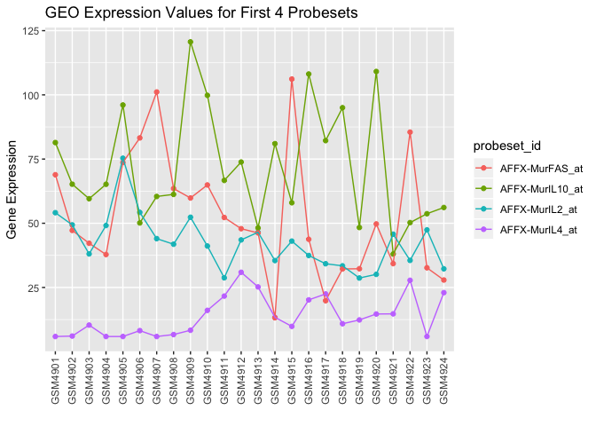
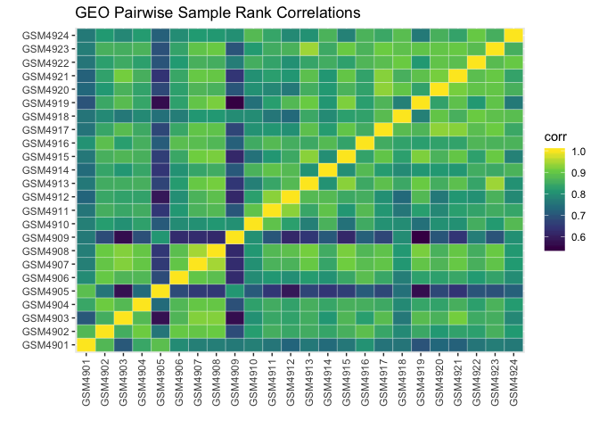

Parsing GEO Data
================
Keith Baggerly
2018-11-12

  - [Overview](#overview)
      - [Introduction](#introduction)
      - [Data and Methods](#data-and-methods)
      - [Results](#results)
  - [Load Libraries](#load-libraries)
  - [Background on the GEO Data](#background-on-the-geo-data)
  - [Parsing the GEO Data](#parsing-the-geo-data)
      - [Loading the GEO Data](#loading-the-geo-data)
      - [Examining SOFT Files](#examining-soft-files)
      - [General Notes](#general-notes)
      - [A Helper Parsing Function](#a-helper-parsing-function)
          - [Get Constants](#get-constants)
          - [Get Sample Info](#get-sample-info)
          - [Get Data Values](#get-data-values)
          - [Return Results](#return-results)
          - [Put the Function Together](#put-the-function-together)
      - [Parsing SOFT Files](#parsing-soft-files)
      - [Combining and Fixing Data](#combining-and-fixing-data)
          - [Creating a Tibble of Sample
            Information](#creating-a-tibble-of-sample-information)
          - [Creating a Tibble of Data
            Values](#creating-a-tibble-of-data-values)
      - [Saving the Tibbles](#saving-the-tibbles)
  - [Initial Exploratory Data
    Analysis](#initial-exploratory-data-analysis)
      - [Consistency of Probeset
        Ordering](#consistency-of-probeset-ordering)
      - [First Few Values](#first-few-values)
      - [Locations of Control (AFFX)
        Probes](#locations-of-control-affx-probes)
      - [Sample ranges](#sample-ranges)
      - [Sample Pairwise Correlation
        Matrix](#sample-pairwise-correlation-matrix)

# Overview

## Introduction

[Potti et al](https://www.nature.com/articles/nm1491) built predictors
of drug response using microarray profiles of the NCI60 cell lines. They
validated these predictors using several publicly available microarray
datasets. One of these datasets, posted to the Gene Expression Omnibus
(GEO), dealt with women with breast cancer who had been treated with
single agent docetaxel ([Chang et
al](https://www.ncbi.nlm.nih.gov/pubmed/12907009), 2003). This GEO
dataset was split into two subsets: GSE349, comprised of samples from
women deemed “resistant” to docetaxel, and GSE350, from women who were
“sensitive”.

Here, we

  - document our understanding of the GEO data more fully,
  - parse the data supplied into summary tibbles to make later analyses
    easier, and
  - perform some basic exploratory data analyses

## Data and Methods

We use the data pulled from the web with `01_gather_raw_data.R`.

We draw documentation from the GEO pages for GSE349 and GSE350, from the
initial paper by Chang et al, and from communication with the Chang et
al authors.

We write a function to parse the SOFT-format data files obtained for
GSE349 and GSE350, and extract tibbles of both sample information and
data values. Per the authors, we fix the Sensitive/Resistant label for
one sample. We combine tibbles across the two GSE subsets to produce one
set of tibbles for the GEO dataset. We put the sample information in
“geo\_sample\_info”, with columns for GSE number, sensitive/resistant
status, GSM number (sample id at GEO), and title (sample id used in the
Chang et al paper). We put the data values in “geo\_data\_values”, with
columns for sample id, probeset id, value, and initial probeset row
index.

We visually examine the values reported for the first few probesets. We
examine and plot basic summary statistics (e.g., sample quantiles). We
plot pairwise sample correlations in a heatmap.

## Results

We walk through assembly of the SOFT parsing function in detail. Using
this function, we extract tibbles of sample information for both GSE349
and GSE350, which we then combine.

We save the tibbles produced in “results/geo\_data.RData”.

We also do some quick exploration. The minimum sample values have been
thresholded to a common value of 5.89822, but nothing else about the
samples looks immediately remarkable.

# Load Libraries

First, we load the libraries we’ll need for this analysis.

``` r
library(tidyverse)
library(here)
```

# Background on the GEO Data

Potti et al describe using the NCI60 data to predict response for
various patient cohorts for which corresponding microarray data were
publicly available. One of these cohorts was a group of 24 women with
breast cancer who were treated with single agent docetaxel; the first
report on this cohort was by [Chang et
al](https://www.ncbi.nlm.nih.gov/pubmed/12907009) in the Lancet in 2003.
Chang et al dichotomized the patients into “Sensitive” and “Resistant”
subcohorts of sizes 11 and 13, respectively. These patient tumors were
interrogated with the same type of microarray (Affymetrix U-95Av2) as
the NCI60 panel, so matching gene measurements will be easier for this
dataset than for others where genes were interrogated using different
strands of cDNA. The gene expression data were posted to the Gene
Expression Omnibus (GEO) as GSE349 (the resistant cohort) and GSE350
(the sensitive cohort). As [supplementary
information](http://www.thelancet.com/pb-assets/Lancet/extras/01art11086webtable.pdf),
the authors provide a table (in pdf) of the expression values by sample
for each of the 92 genes they found to be particularly important for
distinguishing sensitive from resistant.

Interestingly, GSE349 has data for 14 samples, not 13, and GSE350 has
data for 10 samples, not 11. Personal communication with one of the
Chang et al authors (Sue Hilsenbeck) confirmed that one of sensitive
samples had been uploaded with the resistant group by mistake.

> Sample \#377 is mislabeled in the GEO DB. It is listed there as
> resistant, but in reality it was sensitive.

# Parsing the GEO Data

## Loading the GEO Data

Now we load the SOFT data in as character vectors.

``` r
gse349_soft <- readLines(here::here("data", "GSE349_family.soft.gz"))
gse350_soft <- readLines(here::here("data", "GSE350_family.soft.gz"))
```

## Examining SOFT Files

We don’t need or want all of the data in the SOFT files, so we need to
examine and reorganize what we do want.

## General Notes

Each SOFT file is simply a concatentation of text blocks. Each block
begins with a line beginning with “^”. Let’s take a look at the starting
lines for
    GSE349.

``` r
gse349_soft[which(substr(gse349_soft, 1, 1) == "^")]
```

    ##  [1] "^DATABASE = GeoMiame" "^SERIES = GSE349"     "^PLATFORM = GPL8300" 
    ##  [4] "^SAMPLE = GSM4901"    "^SAMPLE = GSM4902"    "^SAMPLE = GSM4904"   
    ##  [7] "^SAMPLE = GSM4905"    "^SAMPLE = GSM4906"    "^SAMPLE = GSM4909"   
    ## [10] "^SAMPLE = GSM4910"    "^SAMPLE = GSM4911"    "^SAMPLE = GSM4912"   
    ## [13] "^SAMPLE = GSM4913"    "^SAMPLE = GSM4916"    "^SAMPLE = GSM4918"   
    ## [16] "^SAMPLE = GSM4922"    "^SAMPLE = GSM4924"

The blocks for DATABASE, SERIES, and PLATFORM deal more with annotation
than with assay values, so we’ll pass on these for now in order to focus
on the gene expression values. Within each of the sample blocks, there
are a few lines of annotation beginning with “\!Sample\_” and a
descriptor, followed by a sample data table. The data table is preceded
by a row of “\!sample\_table\_begin” followed by a header row and then a
tab-delimited table of information, one row per value. Rows immediately
before the sample table indicate both the number of data rows
(“\!Sample\_data\_row\_count”), which is 12625 for all of the arrays
examined here, and the number of columns (one line per column, each
consisting of a hash followed by the column name).

We’ll organize some some of the sample information into a tibble, and
then create a tibble of the data values. As we’re creating the latter
tibble, we’ll add another column which wasn’t in the SOFT table to
indicate the row index of the probeset within the SOFT sample data
table. This information shouldn’t be relevant for analysis, since we
should be matching on probeset (gene) id, but we might find it useful.

## A Helper Parsing Function

Since we’re going to be doing the same parsing more than once, we write
a helper function to take the character vector (“gse\_soft”) returned by
readLines and return a list with the information we want. Specifically,
we extract numeric constants, sample information, and data values.

### Get Constants

The specific constants we want are the number of arrays in the dataset
and the number of measurements in each array.

``` r
n_arrays <- 
  length(grep("^!Series_sample_id", gse_soft))

n_array_values <-
  gse_soft[grep("^!Platform_data_row_count", gse_soft)]
n_array_values <-
  as.numeric(substr(n_array_values,
                    nchar("!Platform_data_row_count = ") + 1,
                    nchar(n_array_values)))
```

### Get Sample Info

The sample information we want is the GSE number (SERIES), the GSE title
(Sensitive or Resistant), the GSM name for each array, and the title
(name the Chang group used) for each array. We save this info in a
tibble.

``` r
gse_series <- gse_soft[grep("^\\^SERIES", gse_soft)]
gse_series <- 
  substr(gse_series, nchar("^SERIES = ") + 1, nchar(gse_series))

gse_title <- gse_soft[grep("^\\!Series_title", gse_soft)]
gse_title <- 
  substr(gse_title, nchar("!Series_title = ") + 1, 
         nchar(gse_title))

gsms <- gse_soft[grep("^\\^SAMPLE", gse_soft)]
gsms <- 
  substr(gsms, nchar("^SAMPLE = ") + 1, nchar(gsms))

gsm_titles <- 
  gse_soft[grep("^\\!Sample_title", gse_soft)]
gsm_titles <- 
  substr(gsm_titles, nchar("!Sample_title = ") + 1,
         nchar(gsm_titles))

sample_info <- 
  tibble(
    gse = gse_series,
    status = gse_title,
    gsm = gsms,
    title = gsm_titles)
```

### Get Data Values

The data values we want are the (probeset, expression value) pairs for
each array. We also record the row index of the probeset in the set of
array values. We save this information in a tibble.

``` r
data_start_rows <- 
  which(gse_soft == "!sample_table_begin") + 2
## use +2 to skip over header row

data_values <- 
  rep("", n_arrays * n_array_values)

start_row <- 1
end_row   <- n_array_values

for(i1 in 1:n_arrays){
  data_values[start_row:end_row] <- 
    gse_soft[data_start_rows[i1]:
               (data_start_rows[i1] + 
                  n_array_values - 1)]
  start_row <- start_row + n_array_values
  end_row   <- end_row   + n_array_values
}

data_values <- 
  matrix(unlist(strsplit(data_values, "\t")), 
         ncol = 2, byrow = TRUE)

data_values <- 
  tibble(
    sample_id = rep(sample_info$gsm, 
                    each = n_array_values),
    probeset_id = data_values[, 1],
    value = as.numeric(data_values[, 2]),
    row_index = rep(c(1:n_array_values), n_arrays))
```

### Return Results

Having pulled everything together, we return the results in a list.

``` r
all_data <- 
  list(n_arrays = n_arrays,
       n_array_values = n_array_values,
       sample_info = sample_info,
       data_values = data_values)

all_data
```

### Put the Function Together

Having assembled all of the pieces, we put them together for use.

    parse_gse_soft_file <- function(gse_soft){
    
      <<get_constants>>
      <<get_sample_info>>
      <<get_data_values>>
      <<return_results>>  
        
    }

## Parsing SOFT Files

Now we parse the SOFT files.

``` r
gse349 <- parse_gse_soft_file(gse349_soft)
gse350 <- parse_gse_soft_file(gse350_soft)
```

As a sanity check, we look at the information returned.

``` r
gse349$sample_info
```

    ## # A tibble: 14 x 4
    ##    gse    status    gsm     title
    ##    <chr>  <chr>     <chr>   <chr>
    ##  1 GSE349 Resistant GSM4901 44   
    ##  2 GSE349 Resistant GSM4902 51   
    ##  3 GSE349 Resistant GSM4904 113  
    ##  4 GSE349 Resistant GSM4905 118  
    ##  5 GSE349 Resistant GSM4906 136  
    ##  6 GSE349 Resistant GSM4909 356  
    ##  7 GSE349 Resistant GSM4910 358  
    ##  8 GSE349 Resistant GSM4911 359  
    ##  9 GSE349 Resistant GSM4912 370  
    ## 10 GSE349 Resistant GSM4913 377  
    ## 11 GSE349 Resistant GSM4916 432  
    ## 12 GSE349 Resistant GSM4918 438  
    ## 13 GSE349 Resistant GSM4922 555  
    ## 14 GSE349 Resistant GSM4924 562

``` r
gse350$sample_info
```

    ## # A tibble: 10 x 4
    ##    gse    status    gsm     title
    ##    <chr>  <chr>     <chr>   <chr>
    ##  1 GSE350 Sensitive GSM4903 71   
    ##  2 GSE350 Sensitive GSM4907 142  
    ##  3 GSE350 Sensitive GSM4908 273  
    ##  4 GSE350 Sensitive GSM4914 413  
    ##  5 GSE350 Sensitive GSM4915 425  
    ##  6 GSE350 Sensitive GSM4917 437  
    ##  7 GSE350 Sensitive GSM4919 447  
    ##  8 GSE350 Sensitive GSM4920 458  
    ##  9 GSE350 Sensitive GSM4921 492  
    ## 10 GSE350 Sensitive GSM4923 558

``` r
gse349$data_values
```

    ## # A tibble: 176,750 x 4
    ##    sample_id probeset_id       value row_index
    ##    <chr>     <chr>             <dbl>     <int>
    ##  1 GSM4901   AFFX-MurIL2_at    54.1          1
    ##  2 GSM4901   AFFX-MurIL10_at   81.4          2
    ##  3 GSM4901   AFFX-MurIL4_at     5.90         3
    ##  4 GSM4901   AFFX-MurFAS_at    68.9          4
    ##  5 GSM4901   AFFX-BioB-5_at  1386.           5
    ##  6 GSM4901   AFFX-BioB-M_at  1595.           6
    ##  7 GSM4901   AFFX-BioB-3_at  1474.           7
    ##  8 GSM4901   AFFX-BioC-5_at  1236.           8
    ##  9 GSM4901   AFFX-BioC-3_at   920.           9
    ## 10 GSM4901   AFFX-BioDn-5_at 1610.          10
    ## # ... with 176,740 more rows

``` r
gse350$data_values
```

    ## # A tibble: 126,250 x 4
    ##    sample_id probeset_id     value row_index
    ##    <chr>     <chr>           <dbl>     <int>
    ##  1 GSM4903   AFFX-MurIL2_at   38.1         1
    ##  2 GSM4903   AFFX-MurIL10_at  59.6         2
    ##  3 GSM4903   AFFX-MurIL4_at   10.4         3
    ##  4 GSM4903   AFFX-MurFAS_at   42.2         4
    ##  5 GSM4903   AFFX-BioB-5_at  460.          5
    ##  6 GSM4903   AFFX-BioB-M_at  488.          6
    ##  7 GSM4903   AFFX-BioB-3_at  569.          7
    ##  8 GSM4903   AFFX-BioC-5_at  370.          8
    ##  9 GSM4903   AFFX-BioC-3_at  289.          9
    ## 10 GSM4903   AFFX-BioDn-5_at 502.         10
    ## # ... with 126,240 more rows

These look reasonable.

## Combining and Fixing Data

We’d actually like to work with the data from both datasets, so we can
combine the sample information and data value tibbles from the derived
from the two SOFT files. We also need to relabel sample 377 (GSM4913) as
Sensitive.

### Creating a Tibble of Sample Information

Now we assemble the sample information for the combined dataset.

``` r
geo_sample_info <- 
  bind_rows(gse349$sample_info, gse350$sample_info)
geo_sample_info$status[geo_sample_info$title == "377"] <-
  "Sensitive"
```

### Creating a Tibble of Data Values

Now we assemble the data values for the combined dataset.

``` r
geo_data_values <- 
  bind_rows(gse349$data_values, gse350$data_values)
```

## Saving the Tibbles

We save these tibbles in an RData file for later use.

``` r
save(geo_sample_info,
     geo_data_values,
     file = here::here("results", "geo_data.RData"))
```

# Initial Exploratory Data Analysis

As a sanity check, we do some quick skims of the data.

## Consistency of Probeset Ordering

We recorded both probeset id and row index for each of the data values,
but in general we would hope the data’s being presented in the same
order across samples. Let’s check if the probesets are in the same rows
across samples.

``` r
test_matches <- 
  geo_data_values %>% 
  select(probeset_id, row_index) %>% 
  group_by(probeset_id) %>% 
  summarise(all_match = all(row_index == row_index[1])) %>% 
  select(all_match) %>% 
  summarise(n_good_probes = sum(all_match)) 

unlist(test_matches)
```

    ## n_good_probes 
    ##         12625

The row indices are the same across all samples for all 12625 probesets.

## First Few Values

We eyeball the values of the first 4 probesets across samples to see if
the samples look comparable.

``` r
geo_first_data <-
  geo_data_values %>% 
  filter(row_index < 5)

geo_first_probeset_plots <- 
  ggplot(geo_first_data, 
         aes(sample_id, value, group = probeset_id,
             colour = probeset_id)) +
  geom_point() + 
  geom_line() +
  ylab("Gene Expression") + 
  xlab("") +
  ggtitle("GEO Expression Values for First 4 Probesets") +
  theme(axis.text.x = 
          element_text(angle = 90, vjust = 0.5, hjust = 1))

geo_first_probeset_plots
```

<!-- -->

These look fine - no clear evidence of something like one probeset
having high values for one subset of samples and low values for the
others. The “MurlL2” probeset sure looks like a negative control (values
are consistently low).

## Locations of Control (AFFX) Probes

The first 4 probesets all have names beginning with “AFFX” (Affymetrix),
indicating these are “control” probes. There should be 67 control
probesets on the Affymetrix U95 arrays used here, so these are probably
in the first 67 positions. Let’s check this.

``` r
control_probes <- 
  geo_data_values %>% 
  filter(grepl("^AFFX", probeset_id))
table(control_probes$row_index)
```

    ## 
    ##  1  2  3  4  5  6  7  8  9 10 11 12 13 14 15 16 17 18 19 20 21 22 23 24 25 
    ## 24 24 24 24 24 24 24 24 24 24 24 24 24 24 24 24 24 24 24 24 24 24 24 24 24 
    ## 26 27 28 29 30 31 32 33 34 35 36 37 38 39 40 41 42 43 44 45 46 47 48 49 50 
    ## 24 24 24 24 24 24 24 24 24 24 24 24 24 24 24 24 24 24 24 24 24 24 24 24 24 
    ## 51 52 53 54 55 56 57 58 59 60 61 62 63 64 65 66 67 
    ## 24 24 24 24 24 24 24 24 24 24 24 24 24 24 24 24 24

Yep, all of the control probes are at the beginning.

## Sample ranges

We also check some standard summary values (min, med, max) in case
something odd shows up.

``` r
geo_sample_ranges <- 
  geo_data_values %>% 
  group_by(sample_id) %>% 
  summarise(q000_min = min(value),
            q050_med = median(value),
            q100_max = max(value))

geo_sample_ranges
```

    ## # A tibble: 24 x 4
    ##    sample_id q000_min q050_med q100_max
    ##    <chr>        <dbl>    <dbl>    <dbl>
    ##  1 GSM4901       5.90     71.8    5710.
    ##  2 GSM4902       5.90     87.6    6450.
    ##  3 GSM4903       5.90     99.6    7142.
    ##  4 GSM4904       5.90     82.0    6075.
    ##  5 GSM4905       5.90     66.0    3536.
    ##  6 GSM4906       5.90     87.1    6859.
    ##  7 GSM4907       5.90     89.0    6364.
    ##  8 GSM4908       5.90    102.     9432.
    ##  9 GSM4909       5.90     62.7    7812.
    ## 10 GSM4910       5.90     76.2    8019.
    ## # ... with 14 more rows

``` r
geo_sample_ranges$q000_min
```

    ##  [1] 5.89822 5.89822 5.89822 5.89822 5.89822 5.89822 5.89822 5.89822
    ##  [9] 5.89822 5.89822 5.89822 5.89822 5.89822 5.89822 5.89822 5.89822
    ## [17] 5.89822 5.89822 5.89822 5.89822 5.89822 5.89822 5.89822 5.89822

The minimum values are all tied at 5.89822, indicating some type of
thresholding effect is present. If there are any issues with the other
summaries, these aren’t as readily apparent.

## Sample Pairwise Correlation Matrix

As a sanity check, we also examine the pairwise sample correlations.
Since all of these samples are of breast tissue, we would expect most of
the genes to have similar expression levels, so correlations should be
clearly positive.

We do this by first mapping from the full data tibble to a gene by
sample matrix of values, compute the correlation matrix using the matrix
implementation in `cor`, and then map back to a tibble for plotting
purposes.

Let’s compute the correlations.

``` r
geo_data_matrix <- 
  geo_data_values %>% 
  select(-starts_with("row")) %>% 
  spread(sample_id, value) %>% 
  select(-probeset_id) %>% 
  as.matrix()

geo_cor_matrix <- 
  cor(geo_data_matrix, geo_data_matrix, method = "spearman")

geo_cor_tibble <- 
  tibble(gsm_1 = rep(colnames(geo_cor_matrix), 
                     each = nrow(geo_cor_matrix)),
         gsm_2 = rep(rownames(geo_cor_matrix),
                     times = ncol(geo_cor_matrix)),
         corr = as.vector(geo_cor_matrix))

rm(geo_data_matrix, geo_cor_matrix)
```

Now we plot a correlation heatmap.

``` r
geo_cor_heatmap <- 
  ggplot(geo_cor_tibble, aes(gsm_1, gsm_2)) + 
  geom_tile(aes(fill = corr), color = "white") + 
  scale_fill_viridis_c() + 
  ylab("") + 
  xlab("") + 
  ggtitle("GEO Pairwise Sample Rank Correlations") +
  theme(axis.text.x = 
          element_text(angle = 90, hjust = 1, vjust = 0.5))

geo_cor_heatmap  
```

<!-- -->

In general, we see the positive correlations we expect. There are a few
samples (GSM4905, GSM4909) which don’t line up with the others as well,
but even here the correlations are above 0.5.
